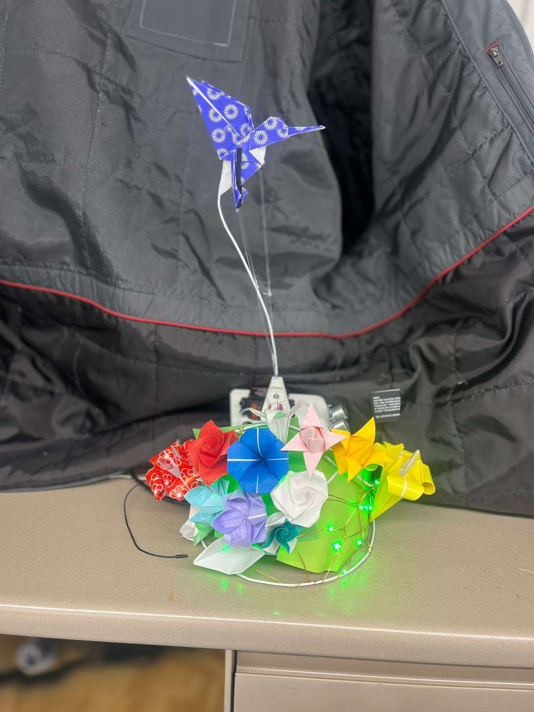
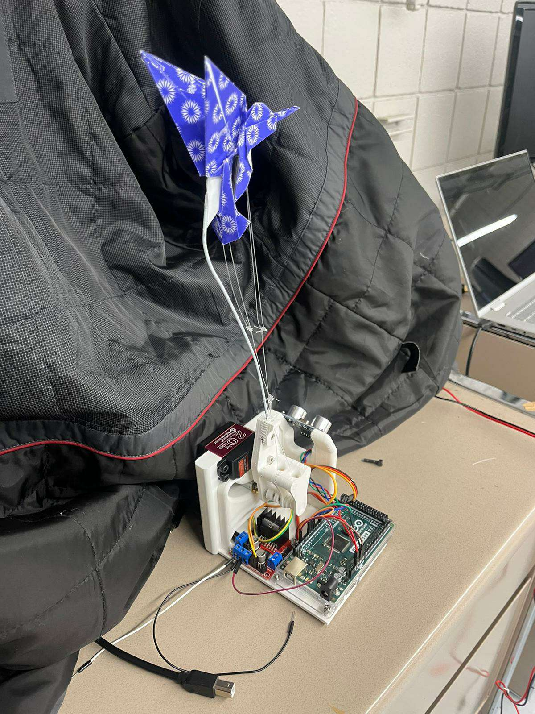
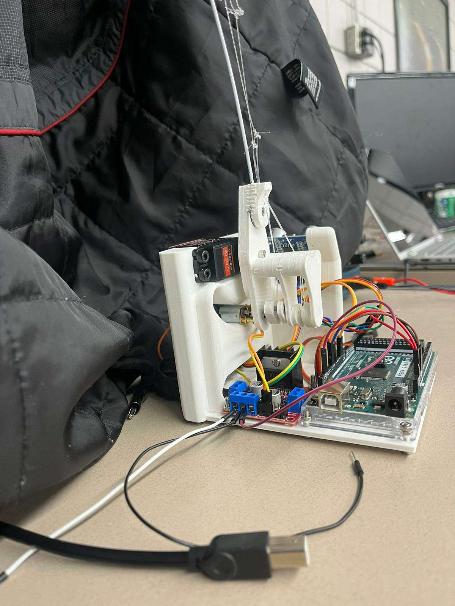

# Origami Hummingbird Robot

This project, developed as a major project for the MEEN 408 Robotic Manipulators class at Texas A&M, features an origami hummingbird whose wings are actuated by fishing lines through a CAM driven by a small DC motor. The robot senses objects in front of it using a sonar sensor and "flies" toward them using a servo.

{:width="400px"}

## A closer look

<p align="center">
  
  
</p>

### How it Works

1. The sonar sensor detects the distance to nearby objects.
2. The DC motor is activated to actuate the wings of the hummingbird.
3. The Servo is activated to move the hummingbird toward the detected object.

<p align="center">
  <a href="assets/initial_test.mp4"></a>
  <a href="assets/flapping_hifreq.mp4"></a>
</p>

## Required Materials

Materials and components used are listed and linked below.

1. [Arduino Mega 2560](https://www.amazon.com/dp/B0046AMGW0/)
2. [Ultrasonic Module Distance Sensor](https://www.amazon.com/dp/B07B94C7KT/)
3. [6V Geared Micro DC motor](https://www.amazon.com/dp/B07555C17Q/)
4. [L298N DC motor driver](https://www.amazon.com/dp/B07BK1QL5T/)
5. [3D printing filament x 1 kg](https://www.amazon.com/dp/B089S1HB8K/)
6. [Jumper Wires](https://www.amazon.com/dp/B01EV70C78)
7. [Metric Nuts and Bolts](https://www.amazon.com/Assortment-M2-M3-M4-M5/dp/B0CBMMPPKF)


## Getting Started

1. Clone this repository:

    ```bash
    git clone https://github.com/daviddoo02/origami_hummingbird_robot.git
    ```

2. Modify the CAD files using Solidworks or use the provided STL files in the `STLs` folder to 3D print your own hummingbird robot.

3. Purchase the required electronics, including Arduino Mega, sonar sensor, DC motor, and a DC motor driver.

4. Flash the code onto the Arduino using the code included in the `arduino_code` folder.

## Assembly Instructions

Assembly instructions are not currently available. However, if there is a significant demand or requests from users, I will consider creating detailed assembly instructions to guide you through the process.

If you have a specific request for assembly instructions, please feel free to open an issue or reach out through the project's communication channels. Your feedback is valuable, and I'll do my best to support your needs.

## License

This project is licensed under the MIT License - see the [LICENSE](LICENSE) file for details.

## Acknowledgments

- Hummingbird design by Michael G. LaFosse.
